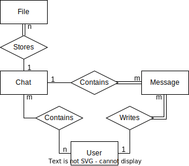

# MyChatGLA
Simple chatrooms website for University of Glasgow students and staff, built using Django.
Make Sure you pull before you commit anything

* ONUR

## Requirements
* User authentication
* User authentication should also be available via external API e.g. Shibboleth, Google, Microsoft
* User friendly interface design with html and css
* Students should be able to chat with eachother, using Ajax for realtime messaging
* Owners of chats should be able to add and remove members and files from chats
* Users should be able to set up a new chat page
* One user can be the owner and/or member of several chats
* Users should be able to view and download files
* Files should have expiry dates attached after which they are no longer accessible 

# Entity Relationship Diagram

